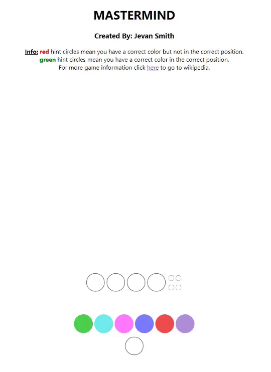

## Authors
Made by: Jevan Smith

## Project Goals
Build a version of Mastermind using react while learning the basics of react and how it works.

## Requirements
- :exclamation: Make sure node.js and npm is installed
- npm install
- npm run start (by default it should run on http://localhost:3000/)

## Insturctions
- red hint circles mean you have a correct color but not in the correct position.
- green hint circles mean you have a correct color in the correct position.
- For more game information https://en.wikipedia.org/wiki/Mastermind_(board_game)

## Expected Outputs Below

